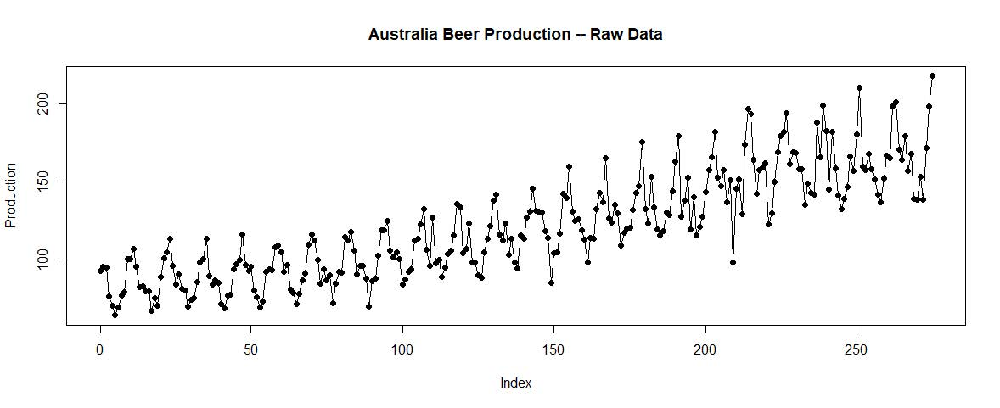
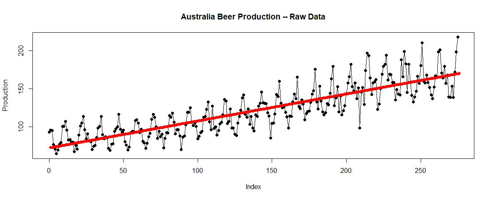
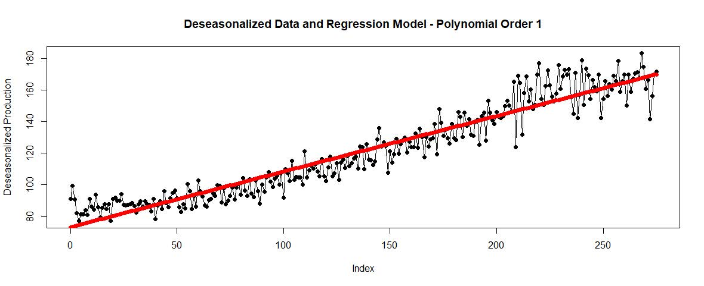
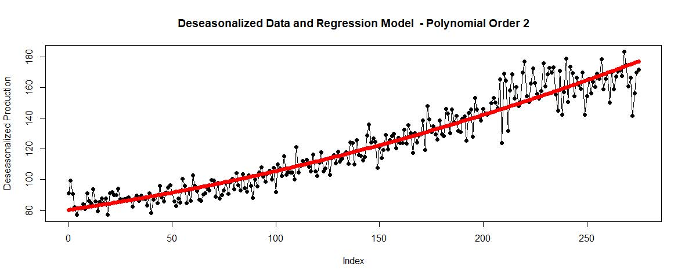
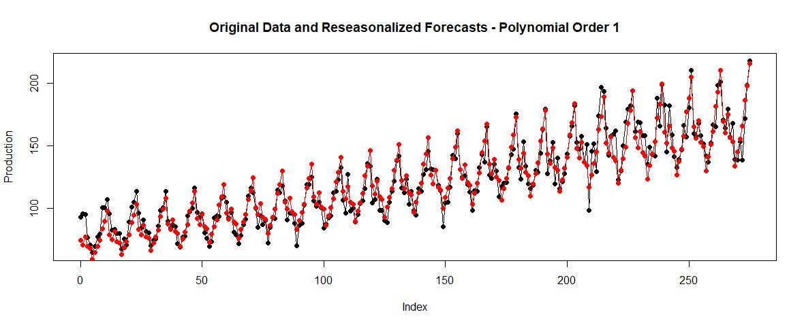
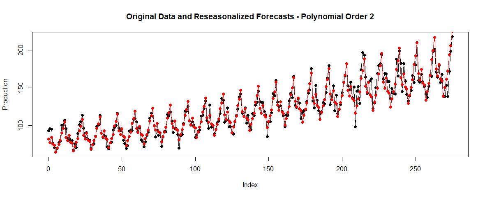

# Time Series Analysis

## Problem Statement
Build a Time Series Model in R and answer the business questions based on the analysis

## Dataset
Dataset contains the monthly production of beer in Australia from January of 1956 to December 1978. The data shown is scaled in megaliters(1 Megaliter = 1million liters).<br>

Dataset can be found here: [Time Series Data](Data/)

## Business Questions
1. Show a line plot of the data using the index as ‘x’ and production as "y" variable.
2. Using all the rows parameterize a base time series simple regression model using "index" as the independent variable and production as dependent variable. State the slope of the regression line and the correlation coefficient between actual and predicted values for production.
3. Show a plot of the time series data with the simple regression line layered on the graph in a contrasting color.
4. Execute and interpret a Durbin-Watson test on the model results.
5. Original data appears to have a pronounced cyclical pattern. Assuming the complete cycles are 12 months long, construct a set of seasonal indices which describe the typical annual fluctuations in production. Use these indices to deseasonalize the production data.
6. Using the deseasonalized to data parameterize two different regression models. A simple regression model will be the base case and a second order polynomial (x2) model which attempts to describe the non-linear secular fluctuations in the deseasonalized data.
7. Reseasonalize the fitted values for each of the two models. Drawing on analysis above, construct a plot showing the original data and the fitted values for each of the two regression models. From a visual review, which model appears to have the better fit to the original beer production data?

## Analysis
**Ask-1**<br>

From the plot above, we can clearly see a cyclical pattern in the data. It follows a secular and seasonal trend. This type data is perfect for time series regression.<br>

**Ask-2**<br>
From the Simple Regression analysis:<br>
- The estimated B – Coefficients for the independent variable is 0.35. The Intercept is 72.86.
- The p-value is < 0.05 for both Intercept and the slope. This states we can reject the null hypothesis and accept the alternate, so we can say the B – Coefficients are not zero and are significant.
- The Regression Equation is y [Production] = 72.863 + 0.354*index.
- The R-sq is 0.7274, that means the X variable explains about 72.74% of variation in Y. But the model is not seeing the cyclical pattern in the data. So, the regression line we see below is the “Best Fit” that R has come up with.
- We can say there is a direct proportionality between [index, Production].
- If index is zero then Production increases by 72.86 Megaliter, which is something we cannot interpret.
- The correlation coefficient is 0.85 which aligns with the data we see in the plot. As the data points are not too spread apart.<br>

**Ask-3**<br>

The plot shows the “Best Fit” of the regression line.<br>

**Ask-4**<br>
- From the Durbin-Watson test above, we can say that there is positive autocorrelation [0.897, the preferred range is 1.5 to 2.5]. We need to do a little detective work going forward.
- P-value is 0, so rejecting the null and accepting the alternate which says there is definitely an autocorrelation.<br>

**Ask-5**<br>
```
#Making Seasonal Indices
indices=data.frame(month=1:12,average=0,index=0)
for(i in 1:12) { 
	count=0 
	for(j in 1:nrow(df)) { 
		if(i==df$month[j]) {
			indices$average[i]=indices$average[i]+df$production[j]
			count=count+1
		}
	}
	indices$average[i]=indices$average[i]/count
	indices$index[i]=indices$average[i]/mean(df$production)}
	 
#Deseasonalizing the original data 
for(i in 1:12){ 
	for(j in 1:nrow(df)){ 
		if(i==df$month[j]){
			df$deseason.production[j]=df$production[j]/indices$index[i] 
		} 
	} 
}
```

Code snipped for Deseasonalizing the data and storing in the original object.<br>

**Ask-6**<br>
<br>
<br>
- Adding a second order polynomial term increases the R-sq from 91.2% to 92.4%.
- In both cases the p-values are below 0.05 so we can reject the null and accept the alternate and say the B-coefficient values are significant.<br>

**Ask-7**<br>
<br>
<br>
From the plots above, both seems to be very similar in terms of the fit to the actuals. But If I had to pick one I’ll pick the second model as the R-sq is higher and if we look very closely, the second aligns with the actuals a bit more at the points near the end.<br>

## Conclusion
This project on time series data helped me to understand how to solve a time series problem and get a general idea on all the steps involved like exploratory data analysis (EDA), checking correlations, regression analysis, seasoning indices, deseasoning, regression with higher polynomials etc.